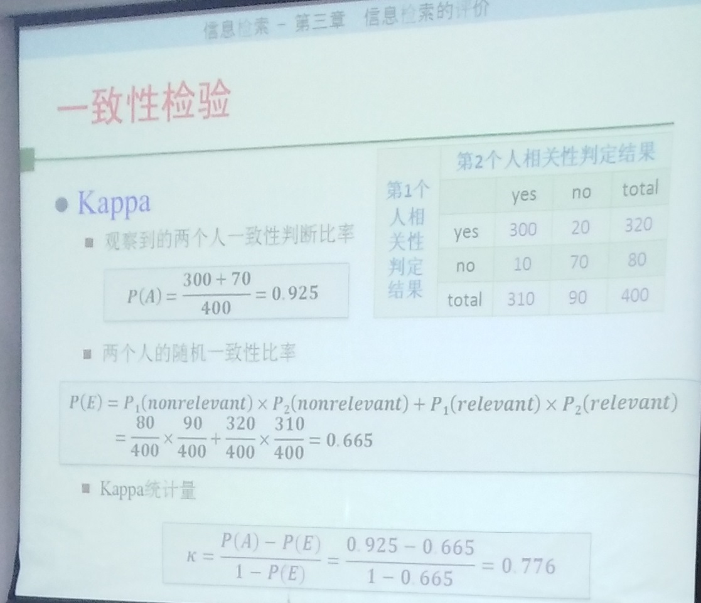

# 三. 信息检索评价

IR中的评价：效率（时间开销、空间开销、响应速度），效果（P、R）

## 1. P、R、F
- P = (RR / RR + RN) 
- R = (RR / RR + NR) 
- 召回率的确定：Pooling方法
- P/R 曲线优缺点
- F = 2PR / (P + R)、 E = （1+&beta;2）/ (&beta;2 / R + 1 / P )
- 精确率：(RR + NN) / (RR + NN + RN + NR)

## 2. 单值概括
- AP(平均准确率)：不同召回率点上的准确率进行平均
- MAP：查询集合中，每个查询的平均准确率的平均值
- R-Precision：位置R的准确率（R为相关文献总数）
- 准确率直方图
- Precision@N 第N个位置的准确率
- RR & MRR：第一个相关文档出现位置的倒数
- Bpref
- NDCG
- 面向用户的测度：覆盖率、新颖率

## 3. 相关评测
TREC

## 4. 一致性检验
Kappa

